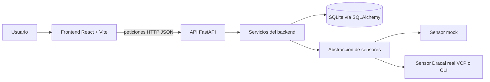
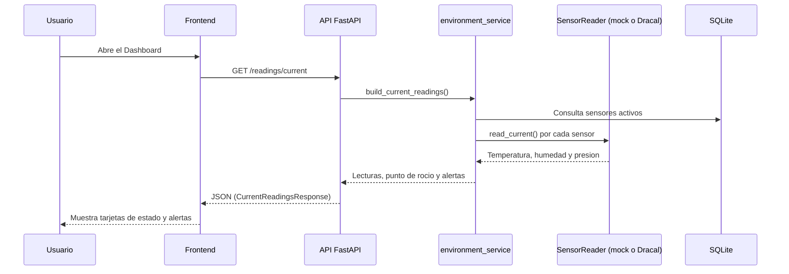
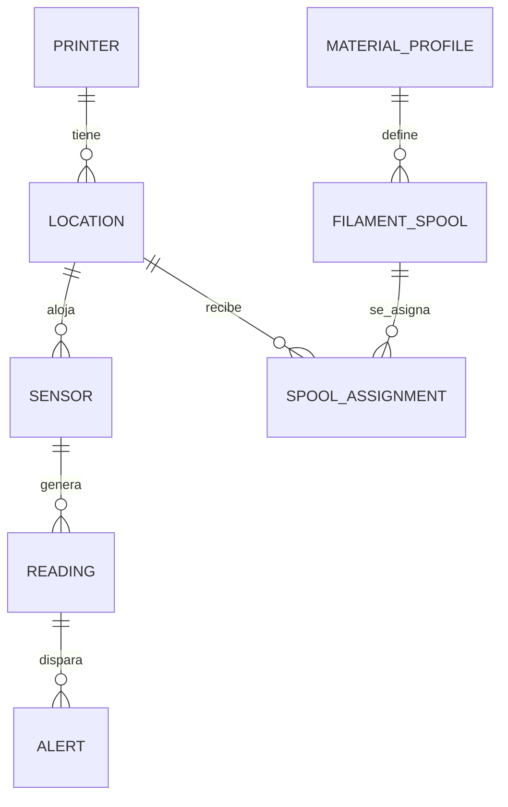
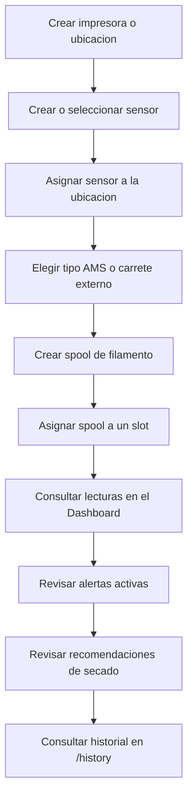

# Guía de Incorporación para Desarrolladores

## 1. Bienvenida y propósito de esta guía

Bienvenido o bienvenida al proyecto **3D Print Materials Environment Data Monitoring Dashboard**.

Esta guía está pensada para una persona que:

- Acaba de recibir acceso al repositorio.
- Tiene conocimientos básicos o intermedios de programación.
- Puede no haber trabajado antes con React o FastAPI.
- Necesita saber **qué ejecutar**, **dónde hacer cambios** y **cómo no romper la aplicación**.

Al terminar de leerla podrás:

- Explicar qué problema resuelve el proyecto y cómo está organizado.
- Instalar, ejecutar y probar el backend y el frontend en tu máquina.
- Entender cómo se comunican frontend, backend, base de datos y sensores.
- Usar Claude Code dentro de este repositorio de forma segura.
- Saber qué archivo tocar según el tipo de cambio que necesites hacer.
- Resolver los problemas más comunes al arrancar el proyecto.

Esta guía **no reemplaza** la documentación existente, la complementa con un recorrido más
progresivo y visual. Documentos relacionados:

- [`README.md`](../README.md) — instalación y referencia rápida del stack.
- [`CLAUDE.md`](../CLAUDE.md) — convenciones internas para trabajar con Claude Code en este repo.
- [`docs/Requirements.md`](Requirements.md) — especificación funcional completa del proyecto.
- [`docs/Tasks.md`](Tasks.md) — historial de fases de implementación ya completadas.
- [`EVIDENCE.md`](../EVIDENCE.md) — evidencia del flujo de trabajo con Claude Code (Plan Mode, TDD,
  revisión de seguridad, etc.).

> [!NOTE]
> Esta guía documenta el estado **real** del repositorio al momento de escribirla. Si algo no
> coincide con lo que ves en tu copia local, confía en el código antes que en este documento y,
> si puedes, actualízalo.

---

## 2. Resumen del proyecto

El proyecto es una aplicación web **local** (no requiere nube ni servidores externos) para vigilar
en tiempo real las condiciones ambientales que afectan el almacenamiento y la preparación de
filamento para impresión 3D: temperatura, humedad relativa, presión atmosférica y punto de rocío.

La humedad es el dato más importante: un filamento húmedo imprime mal y puede necesitar secado
antes de usarse. La aplicación no controla ningún hardware directamente (ni impresoras, ni el
deshumidificador/secador) — solo **mide, alerta y recomienda**.

El dominio del proyecto gira alrededor de impresoras 3D Bambu Lab, sus sistemas de carga de
filamento (AMS o carrete externo), los spools (bobinas) de filamento y los sensores ambientales
(reales o simulados) que vigilan cada ubicación.

| Concepto | Explicación sencilla |
|---|---|
| Impresora (`Printer`) | Equipo de impresión 3D registrado en el sistema (p. ej. un Bambu Lab A1 mini) |
| AMS | Sistema con varios *slots* para cargar filamentos distintos en la misma impresora |
| Ubicación (`Location`) | Dónde vive un sensor: un slot de AMS, un carrete externo, una caja de almacenamiento, una caja/horno de secado o un cuarto |
| Slot | Posición física dentro de un AMS donde se coloca un spool (tiene un `slot_index` estable) |
| Spool (`FilamentSpool`) | Bobina física de filamento, vinculada a un perfil de material |
| Perfil de material (`MaterialProfile`) | Define los límites ambientales ideales/de aviso/críticos y la recomendación de secado de una familia de filamento (o de una variante de un fabricante específico) |
| Sensor (`Sensor`) | Dispositivo (real o simulado) que mide temperatura, humedad y presión |
| Sensor mock | Sensor ficticio creado para pruebas, sin hardware real detrás |
| Reading (`Reading`) | Una lectura ambiental persistida en la base de datos |
| Alert (`Alert`) | Aviso generado cuando una lectura supera un límite del perfil de material |
| Drying recommendation | Recomendación de secado (temperatura/tiempo) calculada para un spool fuera de rango — es solo un consejo, la app no enciende ningún secador |

Desde el Dashboard, un usuario puede: ver las lecturas en vivo agrupadas por impresora/ubicación,
asignar o reasignar sensores, cambiar el tipo de sistema de filamento de una impresora, crear y
asignar spools a slots, revisar alertas activas y consultar recomendaciones de secado e historial.

---

## 3. Tecnologías utilizadas

| Tecnología | Parte del proyecto | Para qué se utiliza |
|---|---|---|
| Python 3.11+ | Backend | Lenguaje del backend |
| FastAPI | Backend | Framework de API REST |
| SQLAlchemy 2.x | Backend | ORM (mapeo objeto-relacional) hacia la base de datos |
| SQLite | Backend | Base de datos local, un solo archivo (`environment_monitor.db`) |
| Pydantic v2 / pydantic-settings | Backend | Validación de datos de entrada/salida y configuración vía variables de entorno |
| pytest | Backend | Framework de pruebas automatizadas |
| pyserial | Backend | Detección y lectura de puertos seriales (COM) para el sensor Dracal real |
| uvicorn | Backend | Servidor ASGI que ejecuta la app FastAPI |
| React 19 + TypeScript | Frontend | Librería de interfaz de usuario y tipado estático |
| Vite | Frontend | Servidor de desarrollo y empaquetador |
| React Router | Frontend | Enrutamiento entre páginas (`/`, `/history`, `/printers`, etc.) |
| TanStack Query | Frontend | Peticiones al backend, caché y refresco automático |
| Tailwind CSS v4 + shadcn/ui (Radix UI) | Frontend | Estilos y componentes de interfaz (botones, tablas, diálogos, etc.) |
| Recharts | Frontend | Gráficas de historial ambiental |
| lucide-react | Frontend | Iconos |
| oxlint | Frontend | Linter (revisor de estilo/errores de código) |
| Vitest + Testing Library | Frontend | Pruebas automatizadas de componentes y lógica |
| Git / GitHub | Todo el proyecto | Control de versiones y repositorio remoto |
| Claude Code | Todo el proyecto | Asistente de desarrollo con agents, skills y hooks propios de este repo |
| MCP (Model Context Protocol) | Herramientas de Claude Code | Conecta Claude Code con servicios externos (ver sección 20) |

El frontend nunca habla directamente con la base de datos ni con los sensores: siempre pasa por la
API del backend. El backend es el único que conoce SQLite y la abstracción de sensores.

---

## 4. Arquitectura general



- **Frontend (React)**: presenta la información — tarjetas de lectura, alertas, formularios,
  gráficas. Vive en `frontend/src/`.
- **API (FastAPI)**: recibe peticiones HTTP, valida datos con Pydantic y delega la lógica a los
  servicios. Vive en `backend/app/api/v1/`.
- **Servicios**: contienen la lógica de negocio (evaluar alertas, calcular recomendaciones de
  secado, capturar lecturas). Viven en `backend/app/services/`.
- **Base de datos (SQLite)**: persiste impresoras, sensores, ubicaciones, spools, lecturas, alertas
  y sesiones de secado.
- **Abstracción de sensores**: decide, por cada sensor configurado, si debe leer un sensor mock o
  hablar con el hardware Dracal real. Vive en `backend/app/sensors/`.

---

## 5. Flujo de datos

Cuando el Dashboard pide las lecturas actuales, ocurre lo siguiente:

1. El frontend hace `GET /readings/current` (con sondeo periódico automático).
2. FastAPI recibe la solicitud y la delega al servicio `environment_service.build_current_readings`.
3. El servicio consulta en SQLite qué sensores están activos (y no archivados).
4. Para cada sensor, pide al *factory* de sensores (`sensors/factory.py`) el lector correcto (mock o
   Dracal real) y obtiene una lectura.
5. El servicio calcula el punto de rocío y evalúa alertas contra el perfil de material del spool
   asignado a esa ubicación (si existe).
6. La API responde con un JSON que incluye lecturas, ubicación, spools afectados y alertas.
7. El frontend actualiza las tarjetas del Dashboard.
8. Por separado, un bucle en segundo plano (`auto_capture.py`) persiste periódicamente una lectura
   real en la tabla `readings` (ver sección 12) para que el historial y las alertas persistidas
   tengan datos sin que nadie tenga que pulsar un botón manualmente.



> [!NOTE]
> `GET /readings/current` **no persiste nada** — es una foto instantánea. Solo `POST /readings`
> (manual o automático vía `auto_capture.py`) escribe filas nuevas en la tabla `readings`.

---

## 6. Estructura del repositorio

```text
project-root/
├── backend/
│   ├── app/
│   │   ├── api/v1/        Routers de FastAPI (uno por recurso)
│   │   ├── services/      Logica de negocio
│   │   ├── repositories/  Ayudantes de consulta SQLAlchemy
│   │   ├── models/        Modelos ORM (tablas)
│   │   ├── schemas/       Modelos Pydantic (entrada/salida de la API)
│   │   ├── sensors/       Abstraccion de sensores (mock, Dracal VCP, Dracal CLI)
│   │   ├── db/            Configuracion de conexion + seed inicial
│   │   └── main.py        Punto de entrada de la app FastAPI
│   ├── tests/              Pruebas pytest (api/, services/, sensors/, db/)
│   └── requirements.txt
├── frontend/
│   └── src/
│       ├── api/            Cliente HTTP tipado + wrappers por recurso
│       ├── components/     Componentes de UI (formularios, paneles, layout)
│       │   └── ui/         Primitivas shadcn/ui (Button, Card, Dialog, Table, ...)
│       ├── pages/           Una pagina por ruta (Dashboard, Sensors, Printers, ...)
│       ├── hooks/           Hooks de React + hooks/resources/* (uno por recurso del backend)
│       ├── lib/             Funciones auxiliares puras (formato, filtros, estado)
│       └── types/           Interfaces TypeScript que reflejan los schemas del backend
├── docs/                    Documentacion funcional y guias tecnicas
├── docs/Tareas/              Carpetas de tareas no triviales (una por funcionalidad/fix)
├── evidence/                Evidencia de uso de Claude Code (logs, capturas, revision de seguridad)
├── .claude/
│   ├── agents/              Subagentes especializados
│   ├── skills/               Skills reutilizables
│   ├── hooks/                Scripts que reaccionan a eventos de Claude Code
│   └── settings.json         Conecta los hooks con sus eventos
├── CLAUDE.md
├── README.md
└── EVIDENCE.md
```

| Ruta | Función general | Cuándo modificarla |
|---|---|---|
| `backend/app/api/v1/` | Define los endpoints HTTP | Al agregar o cambiar un endpoint |
| `backend/app/services/` | Lógica de negocio | Al cambiar una regla (alertas, recomendaciones, etc.) |
| `backend/app/models/` | Tablas de la base de datos | Al agregar/cambiar un campo o entidad persistida |
| `backend/app/schemas/` | Forma de los datos que entran/salen de la API | Al cambiar qué campos expone o acepta un endpoint |
| `backend/app/sensors/` | Lectura de sensores reales/mock | Al ajustar el parseo del Dracal o el comportamiento del mock |
| `backend/app/db/seed.py` | Datos iniciales de demostración | Al cambiar impresoras/sensores/materiales sembrados por defecto |
| `backend/tests/` | Pruebas automatizadas del backend | Siempre que cambies comportamiento del backend |
| `frontend/src/pages/` | Una página por ruta del Dashboard | Al cambiar una vista completa |
| `frontend/src/components/` | Piezas de interfaz reutilizables | Al cambiar un formulario, panel o tarjeta |
| `frontend/src/hooks/resources/` | Conexión con cada recurso del backend vía TanStack Query | Al agregar una acción nueva sobre un recurso (p. ej. duplicar) |
| `frontend/src/api/config.ts` | Definición de las llamadas HTTP por recurso | Al agregar un endpoint nuevo en el backend que el frontend deba usar |
| `docs/Tareas/` | Documentación de cada tarea no trivial | Antes de implementar una funcionalidad/fix/refactor no trivial |
| `.claude/agents/`, `.claude/skills/`, `.claude/hooks/` | Configuración de Claude Code | Al ajustar cómo Claude Code trabaja en este repo |

---

## 7. Backend explicado para un desarrollador nuevo

**FastAPI** es un framework de Python para construir APIs REST (interfaces donde el frontend pide y
envía datos mediante HTTP, normalmente en formato JSON). Una **API REST** expone *endpoints*
(rutas como `/sensors` o `/readings/current`) que responden a verbos HTTP (`GET` para leer, `POST`
para crear, `PATCH` para actualizar parcialmente, `DELETE` para eliminar).

Este backend organiza el código en capas:

| Capa | Responsabilidad | Ejemplo real del proyecto |
|---|---|---|
| Router (`api/v1/*.py`) | Recibe la petición HTTP, valida la forma de los datos y llama al servicio | `backend/app/api/v1/sensors.py` |
| Schema (`schemas/*.py`) | Define, con Pydantic, qué forma deben tener los datos de entrada/salida | `backend/app/schemas/sensor.py` (`SensorCreate`, `SensorRead`, ...) |
| Servicio (`services/*.py`) | Contiene la lógica de negocio real | `backend/app/services/sensor_service.py` |
| Modelo (`models/*.py`) | Define una tabla de la base de datos con SQLAlchemy | `backend/app/models/sensor.py` |
| Repository (`repositories/*.py`) | Consultas SQLAlchemy reutilizables (solo existe para `Reading` hoy) | `backend/app/repositories/reading_repository.py` |

Flujo típico de una petición:

```text
Solicitud HTTP → Router → Servicio → Modelo (SQLAlchemy) → Base de datos
```

La lógica de negocio **no** vive directamente en los routers: esto mantiene los endpoints simples
de leer y permite reutilizar la misma lógica desde otro lugar (por ejemplo, el seed inicial reutiliza
`sensor_validation.py`, la misma validación que usa el endpoint de crear sensores).

Configuración: `backend/app/core/config.py` define una clase `Settings` (Pydantic) que lee variables
de entorno desde un archivo `.env` (ver sección 23). Errores HTTP se devuelven con
`HTTPException` de FastAPI (por ejemplo, 404 si un recurso no existe, 400 si viola una regla de
negocio, 422 si los datos de entrada no son válidos).

---

## 8. Endpoints principales

Estos tres endpoints son obligatorios para la asignación y están cubiertos por pruebas pytest:

| Método | Endpoint | Función | Datos principales |
|---|---|---|---|
| `GET` | `/readings/current` | Una lectura (o error de lectura) por cada sensor activo | Temperatura, humedad, presión, punto de rocío, alertas y ubicación |
| `POST` | `/readings` | Sin cuerpo: captura y persiste una lectura de cada sensor activo. Con cuerpo: persiste una lectura manual/mock validada | Igual que arriba + origen (`real`, `mock`, `manual`) |
| `GET` | `/readings?from=&to=` | Historial de lecturas en un rango de fechas, con `aggregate=hour` opcional para promedios por hora | Lista de lecturas + promedios horarios |

Además existen endpoints REST extendidos para el resto de entidades. Los recursos `printers`,
`sensors`, `locations`, `materials` y `spools` comparten el mismo patrón:

| Método | Ruta (patrón) | Función |
|---|---|---|
| `GET` | `/{recurso}` | Lista los registros activos (`?deleted_only=true` lista los archivados) |
| `POST` | `/{recurso}` | Crea un registro |
| `GET` | `/{recurso}/{id}` | Obtiene un registro por id |
| `PATCH` | `/{recurso}/{id}` | Actualiza campos parcialmente |
| `DELETE` | `/{recurso}/{id}` | Elimina permanentemente (falla con 400 si otro registro depende de él) |
| `POST` | `/{recurso}/{id}/archive` | Archiva (borrado suave, reversible) |
| `POST` | `/{recurso}/{id}/restore` | Restaura un registro archivado |
| `POST` | `/{recurso}/{id}/duplicate` | Crea una copia como plantilla |

`sensors` añade además `GET /sensors/ports` (detección de puertos seriales) y
`POST /sensors/{id}/test-read` (lectura de prueba, sin persistir nada). `assignments` y `alerts` no
tienen archivar/restaurar/duplicar — `assignments` solo tiene `GET/POST/PATCH/DELETE`, y `alerts`
solo `GET /alerts` y `PATCH /alerts/{id}/resolve`. También existen `GET /drying/recommendations`,
`POST /drying/sessions`, `GET /drying/sessions` y `PATCH /drying/sessions/{id}` para las
recomendaciones y sesiones de secado.

> [!NOTE]
> La lista interactiva y siempre actualizada de endpoints está disponible en
> `http://localhost:8000/docs` (Swagger UI) mientras el backend está corriendo.

Ejemplo real de petición y respuesta (sin datos sensibles):

```http
GET /readings/current
```

```json
{
  "sensors": [
    {
      "sensor": { "id": 2, "serial_number": "MOCK-0001", "model": "mock", "sensor_type": "mock" },
      "location_id": 2,
      "location": { "id": 2, "name": "AMS Slot 1 - A1 mini #1", "location_type": "printer_ams", "printer_id": 1 },
      "timestamp": "2026-07-20T10:00:00+00:00",
      "temperature_c": 24.3,
      "relative_humidity_percent": 38.1,
      "pressure_pa": 101200.0,
      "pressure_kpa": 101.2,
      "dew_point_c": 9.8,
      "source": "mock",
      "affected_spools": [],
      "alerts": [],
      "error": null
    }
  ],
  "message": null
}
```

---

## 9. Base de datos

**SQLite** es una base de datos relacional que vive en un solo archivo
(`backend/environment_monitor.db`, se crea sola al primer arranque). **SQLAlchemy** es el ORM que
permite describir tablas como clases de Python (`backend/app/models/*.py`) y consultarlas sin
escribir SQL a mano.

La conexión se configura en `backend/app/db/session.py`, usando `DATABASE_URL` (ver sección 23).
Al arrancar la app (`backend/app/main.py`), se ejecuta `Base.metadata.create_all(...)` (crea las
tablas que falten) y luego `seed(session)` (siembra datos de demostración de forma **idempotente**
— se puede ejecutar muchas veces sin duplicar nada).

> [!WARNING]
> Este proyecto **no usa ninguna herramienta de migraciones** (no hay Alembic). Si cambias un
> modelo (agregas o quitas una columna), debes borrar `backend/environment_monitor.db` y reiniciar
> `uvicorn` para que se recree con el nuevo esquema — de lo contrario la app puede fallar o ignorar
> el cambio.

Modelos principales y sus relaciones:

- `Printer` → tiene varias `Location` (slots de AMS, carrete externo, etc.).
- `Location` → puede alojar un `Sensor` y puede recibir asignaciones de spool (`SpoolAssignment`).
- `MaterialProfile` → define los límites de varios `FilamentSpool`.
- `FilamentSpool` → tiene varias `SpoolAssignment` (historial de a qué ubicación estuvo asignado).
- `Sensor` → genera varias `Reading`.
- `Reading` → puede disparar varias `Alert`.
- También existe `DryingSession` (una sesión de secado para un spool en una ubicación tipo secador).



`Printer`, `Sensor`, `Location`, `MaterialProfile` y `FilamentSpool` usan un mecanismo de "borrado
suave" (`SoftDeleteMixin`, columna `deleted_at`): archivar no borra la fila, solo la oculta de los
listados normales, y se puede restaurar. `Reading`, `Alert`, `SpoolAssignment` y `DryingSession` no
lo usan — son registros históricos que solo se eliminan permanentemente.

---

## 10. Frontend explicado para un desarrollador nuevo

**React** es una librería para construir interfaces a partir de **componentes**: funciones que
reciben datos (`props`) y devuelven la interfaz que deben mostrar. Un **hook** es una función
especial de React (siempre empieza con `use`) que permite manejar estado, efectos secundarios o
lógica reutilizable dentro de un componente.

La interfaz se organiza así:

| Parte del frontend | Función | Ruta real |
|---|---|---|
| Páginas | Una por ruta del Dashboard (Dashboard, History, Alerts, Printers, PrinterDetail, Materials, Spools, Sensors, Drying, Trash, Settings) | `frontend/src/pages/` |
| Componentes | Piezas de interfaz reutilizables (formularios, tarjetas, paneles, layout) | `frontend/src/components/` |
| Primitivas de UI | Botones, tablas, diálogos, etc. de shadcn/ui | `frontend/src/components/ui/` |
| Cliente API | Función `fetch` tipada + un objeto por recurso (`sensorsApi`, `printersApi`, ...) | `frontend/src/api/client.ts`, `frontend/src/api/config.ts` |
| Hooks de recurso | Conectan cada recurso del backend con TanStack Query (listar, crear, actualizar, archivar, ...) | `frontend/src/hooks/resources/*.ts` |
| Tipos | Interfaces TypeScript que reflejan los schemas del backend | `frontend/src/types/api.ts` |

Flujo típico:

```text
Pagina -> Componente -> Hook de recurso (TanStack Query) -> api/config.ts -> Backend -> Estado actualizado -> Renderizado
```

Cada hook de recurso maneja automáticamente los estados de carga (`isPending`), error (`isError`) y
éxito, y refresca la caché cuando se crea/actualiza/archiva algo, para que las páginas siempre
muestren datos consistentes sin pedirlos manualmente de nuevo. El tema oscuro/claro se controla con
`useTheme` (`frontend/src/hooks/useTheme.ts`) y se guarda en `localStorage`, con modo oscuro activo
por defecto.

---

## 11. Dashboard y flujo de uso

Pasos típicos para dejar el sistema monitoreando una impresora nueva desde cero:

1. Crear la impresora en `/printers` (o usar una de las 7 sembradas por defecto).
2. Crear o seleccionar un sensor en `/sensors` (real o mock) y asignarlo a una ubicación —también
   se puede hacer directamente desde el Dashboard con el botón "Change"/"+ Assign sensor".
3. Elegir el tipo de sistema de filamento de la impresora (AMS, carrete externo, o ambos).
4. Crear un spool de filamento en `/spools`, eligiendo su perfil de material.
5. Asignar el spool a un slot/ubicación (desde `/spools` o desde el propio Dashboard).
6. Consultar los valores ambientales en vivo en el Dashboard (`/`).
7. Revisar alertas activas (icono de campana en la cabecera, o `/alerts` para el historial).
8. Revisar recomendaciones de secado en `/drying` cuando un spool esté fuera de rango.
9. Consultar el historial de lecturas en `/history`.



---

## 12. Sensores reales

El proyecto usa como sensor real un **Dracal `VCP-PTH450-CAL`** (serial `E27297`), que mide
temperatura, humedad relativa y presión atmosférica.

Existen dos formas de conectarlo, según cómo lo exponga el driver de Windows del dispositivo:

- **`dracal_vcp`**: el sensor aparece como un **puerto serial** (un "puerto COM" en Windows, por
  ejemplo `COM3`) que expone líneas de texto con las lecturas. Requiere que el sensor tenga un
  `port` configurado.
- **`dracal_cli`**: para dispositivos cuyo driver los expone como un dispositivo USB genérico (sin
  puerto COM), se usa la herramienta de línea de comandos del fabricante (`dracal-usb-get`) e
  identifica el sensor solo por su `serial_number`, sin necesidad de puerto.

> [!NOTE]
> El puerto COM asignado puede cambiar entre computadoras y entre sistemas operativos — no lo
> hardcodees en el código, siempre debe venir del campo `port` del sensor en la base de datos.

Pasos para registrar y probar un sensor real:

1. Ir a `/sensors` y usar `GET /sensors/ports` (botón de detección de puertos en la UI) para ver
   los puertos disponibles, o revisar manualmente el Administrador de dispositivos de Windows.
2. Crear el sensor con `sensor_type` = `dracal_vcp` o `dracal_cli`, su `serial_number` real y (si
   aplica) el `port` detectado.
3. Asignarlo a una ubicación (`location_id`).
4. Usar el botón "Test" (o `POST /sensors/{id}/test-read`) para hacer una lectura de prueba **sin
   persistir nada** — sirve para confirmar que el sensor responde antes de depender de él.

Si el sensor no está conectado o el puerto es incorrecto, la lectura de ese sensor específico
falla de forma aislada: el campo `error` de esa entrada en `GET /readings/current` (o el resultado
de `test-read`) describe el problema, pero **no bloquea** las lecturas de los demás sensores ni
inventa un valor de reemplazo.

Errores comunes: puerto ocupado por otro programa, puerto incorrecto (el sensor se movió a otro
puerto USB), cable desconectado, o `serial_number` que no coincide con el que realmente responde en
ese puerto (el parser del backend rechaza la lectura si el serial no coincide, para evitar leer un
sensor equivocado por error).

No se necesitan credenciales para el sensor real — solo el puerto/serial correctos.

---

## 13. Sensores mock

Un **sensor mock** es un sensor simulado: no existe hardware detrás, sus valores se generan en
código (`backend/app/sensors/mock.py`) mediante una caminata aleatoria acotada más una variación
diaria suave, con excursiones raras fuera de rango para poder demostrar alertas. Cada sensor mock
mantiene su propio estado (semilla derivada de su `serial_number`), así varios sensores mock no se
mueven todos igual.

Para crear uno: en `/sensors`, elegir `sensor_type` = `mock` y un `serial_number` que **empiece con
el prefijo `MOCK-`** (por ejemplo `MOCK-0004`) — esto es obligatorio, se valida al crear y al
actualizar. Un sensor mock **nunca** puede usar el serial real del Dracal (`E27297`); esa
combinación se rechaza explícitamente para no confundir un sensor simulado con el hardware real.

| Característica | Sensor real | Sensor mock |
|---|---|---|
| `sensor_type` | `dracal_vcp` o `dracal_cli` | `mock` |
| Requiere hardware | Sí | No |
| `serial_number` | El del dispositivo físico (p. ej. `E27297`) | Debe empezar con `MOCK-` |
| Requiere `port` | Solo `dracal_vcp` | No |
| Origen de la lectura (`source`) | `real` | `mock` |
| Puede fallar por hardware desconectado | Sí | No |

Los sensores mock sembrados por defecto están **activos desde el arranque**, precisamente para que
la aplicación funcione completa sin ningún hardware conectado — este es un requisito explícito del
proyecto (ver `CLAUDE.md`, "Development Priorities").

---

## 14. Reglas importantes de asignación

- Un sensor (identificado por su `serial_number`) no puede estar asignado a más de una ubicación al
  mismo tiempo — se valida al asignarlo/reasignarlo.
- Un módulo de AMS completo comparte un único sensor (no uno por slot) — asignar un segundo sensor
  a un slot hermano del mismo módulo se rechaza.
- Un spool solo puede tener una asignación **activa** a la vez (`SpoolAssignment.is_active`);
  reasignarlo a otra ubicación primero desactiva la asignación anterior.
- Un sensor inactivo (`is_active=false`) o archivado no genera lecturas en `GET /readings/current`
  ni participa en la captura automática/manual.
- Un slot sin spool asignado se muestra vacío, nunca con datos inventados.
- Los sensores mock deben crearse explícitamente con el prefijo `MOCK-` — no existe un "modo mock
  global" que sustituya sensores faltantes.
- Las recomendaciones de secado dependen del perfil de material del spool y de la última lectura
  ambiental disponible para su ubicación (o las ubicaciones hermanas del mismo módulo de AMS).
- Los perfiles de material específicos de un fabricante sobreescriben los valores genéricos de su
  familia (por ejemplo, un PLA de una marca concreta puede tener límites más estrictos que "PLA"
  genérico).

---

## 15. Claude Code dentro del proyecto

**Claude Code** es un asistente de desarrollo que se ejecuta desde la terminal, con acceso directo
al código de este repositorio. Se abre ejecutando `claude` desde la **raíz del proyecto** (donde
está `CLAUDE.md`).

Usa como contexto principal: `CLAUDE.md` (convenciones de este repo), los archivos que le pidas
leer o que él mismo explore, y — cuando aplican — los agents/skills/hooks de `.claude/`.

Existen dos modos relevantes para trabajar de forma segura:

- **Ask Mode**: para preguntas o decisiones puntuales (Claude Code pregunta antes de continuar
  cuando algo depende de una decisión tuya).
- **Plan Mode**: para funcionalidades no triviales — Claude Code investiga el código, propone un
  plan por escrito, y **espera tu aprobación** antes de tocar archivos. `CLAUDE.md` exige usar Plan
  Mode antes de implementar cambios no triviales.

> [!WARNING]
> Revisa siempre el plan antes de aprobarlo en cambios grandes — es más fácil corregir un plan que
> deshacer código ya escrito.

Ejemplos breves de prompts (en español, tal como se usarían con Claude Code en este repo):

```text
Analiza cómo funciona la validación de sensores mock en backend/app/services/sensor_validation.py
```

```text
Entra en Plan Mode y diseña un plan para agregar un nuevo campo "nozzle_diameter_mm" al spool.
```

```text
Hay un bug: el filtro de estado de sensor en el Dashboard no oculta los sensores archivados. Investígalo y corrígelo.
```

```text
Ejecuta la suite completa de pytest y de vitest y dime si algo falla.
```

```text
Actualiza docs/Tasks.md marcando como completada la fase que acabamos de terminar.
```

---

## 16. Archivo CLAUDE.md

`CLAUDE.md` está en la raíz del repositorio porque Claude Code lo carga automáticamente como
contexto de proyecto en cada sesión. Contiene las convenciones internas del repo: estructura de
carpetas del backend/frontend, reglas de dominio (p. ej. "la humedad es la métrica principal"),
el flujo de Git esperado, requisitos de pruebas y evidencia, y la lista de agents/skills
recomendados.

Debe actualizarse cuando cambie una convención real del proyecto (por ejemplo, si cambia el
esquema de ramas de Git o se agrega un nuevo agent). No debe contener secretos, credenciales ni
información que solo aplique a una tarea puntual (eso va en `docs/Tareas/<tarea>/TASK.md`).

| Archivo | Audiencia | Propósito |
|---|---|---|
| `README.md` | Usuarios y desarrolladores | Instalar, ejecutar y entender el proyecto |
| `CLAUDE.md` | Claude Code y desarrolladores | Convenciones e instrucciones internas del repo |

---

## 17. Agents

Un **subagente (agent)** es un asistente especializado con un propósito acotado, su propio conjunto
de herramientas permitidas y (normalmente) un límite de turnos — se usa para delegar una parte del
trabajo sin saturar la conversación principal con el detalle de esa tarea. Claude Code puede
invocarlos automáticamente cuando la tarea encaja con su descripción, o tú puedes pedirlo
explícitamente.

Agents reales en `.claude/agents/`:

| Agent | Propósito | Cuándo utilizarlo | Archivos relacionados |
|---|---|---|---|
| `backend-fastapi-architect` | Diseñar e implementar endpoints FastAPI, schemas Pydantic, modelos SQLAlchemy, servicios y pruebas del backend | Al construir o modificar un endpoint/servicio del backend | `backend/app/**` |
| `sensor-integration-specialist` | Parseo de sensores Dracal PTH450 (VCP/CLI), comportamiento del sensor mock, factory de sensores, expansión multi-sensor | Al tocar la lectura/validación de sensores | `backend/app/sensors/**`, `backend/app/services/sensor_*.py` |
| `frontend-react-dashboard` | Construir pantallas React/TypeScript, tarjetas de lectura en vivo, paneles de alertas, formularios de materiales, vistas de historial con Recharts | Al construir o modificar UI del Dashboard | `frontend/src/**` |
| `qa-tdd-engineer` | Crear pruebas pytest, guiar ciclos TDD, verificar endpoints, capturar evidencia de pruebas fallidas/pasando | Al escribir pruebas o validar un endpoint | `backend/tests/**` |
| `security-reviewer` | Revisar endpoints, manejo de entrada de sensores, seguridad de puertos seriales, CORS, persistencia, manejo de secretos, seguridad de hooks | Antes de cerrar una tarea con superficie de seguridad relevante | Todo el backend + `.claude/hooks/` |
| `docs-evidence-curator` | Mantener `README.md`, `EVIDENCE.md`, documentación del proyecto y el checklist final de entrega | Al actualizar documentación o evidencia | `README.md`, `EVIDENCE.md`, `docs/**` |
| `materials-domain-specialist` | Definir perfiles de material editables, límites ambientales, alertas de humedad, manejo de materiales derivados, lógica de recomendaciones de secado | Al ajustar reglas de negocio de materiales/secado | `backend/app/services/material_profile_service.py`, `drying_service.py` |
| `context-handoff-specialist` | Generar un documento de traspaso de contexto antes de una compactación o bajo pedido manual | Cuando el contexto de la conversación se acerca a su límite, o al pedir `/context-handoff` | `.claude/context-handoffs/` |

No hace falta crear un agent nuevo para cada tarea pequeña — solo cuando una responsabilidad se
repite mucho y se beneficia de tener su propio contexto/herramientas acotadas.

---

## 18. Skills

Un **skill** es un conjunto de instrucciones reutilizables para un tipo de tarea repetible (por
ejemplo, "crear un endpoint siguiendo siempre el mismo orden de pasos"). A diferencia de escribir el
mismo prompt largo cada vez, un skill se invoca por nombre y ya trae las reglas del proyecto
incorporadas.

Skills reales en `.claude/skills/`:

| Skill | Función | Entrada esperada | Resultado |
|---|---|---|---|
| `fastapi-endpoint-builder` | Crear o modificar endpoints FastAPI, schemas Pydantic y persistencia SQLAlchemy con pruebas | Descripción del endpoint/cambio deseado | Endpoint + schema + servicio + pruebas pytest |
| `react-chart-dashboard` | Construir componentes del Dashboard, tarjetas de lectura, gráficas de historial, paneles de alertas | Descripción de la vista/componente deseado | Componente(s) React siguiendo las reglas de UI del proyecto |
| `material-profile-manager` | Implementar perfiles de material, límites ambientales, materiales derivados, alertas de humedad y recomendaciones de secado | Descripción de la regla de negocio de materiales | Cambios en el dominio de materiales/secado |
| `pytest-tdd-cycle` | Ejecutar un ciclo TDD completo con evidencia guardada en `/evidence` | Comportamiento a probar | Prueba fallida → implementación → prueba pasando, documentado |
| `evidence-capture` | Actualizar `EVIDENCE.md` o `/evidence` con prueba de Plan Mode, TDD, documentación, revisión de seguridad, MCP de GitHub, skills y hooks | Hito de flujo de trabajo a documentar | Entrada nueva en `EVIDENCE.md`/`evidence/` |
| `context-handoff` | Generar un documento de traspaso de contexto antes de compactar o bajo pedido manual (`/context-handoff`) | — (se dispara automáticamente o por comando) | Archivo en `.claude/context-handoffs/` |

Cada skill vive en su propia carpeta como `SKILL.md` con una cabecera (`name`, `description`,
`allowed-tools`) seguida de las reglas en Markdown. Para modificar uno de forma segura: edita solo
las reglas del propio skill, sin quitar la cabecera, y verifica que siga reflejando el
comportamiento real del proyecto (no reglas aspiracionales).

---

## 19. Hooks

Un **hook** es un script que Claude Code ejecuta automáticamente cuando ocurre un evento específico
(por ejemplo, antes de correr un comando de terminal, o después de editar un archivo). Sirven para
aplicar reglas de seguridad o calidad sin depender de que alguien se acuerde de hacerlo a mano.

Hooks reales, definidos en `.claude/hooks/` y conectados en `.claude/settings.json`:

| Hook | Evento | Función | Resultado esperado |
|---|---|---|---|
| `guard-dangerous-commands.py` | `PreToolUse` (Bash/PowerShell) | Bloquea comandos destructivos (`rm -rf`, `DROP DATABASE`, `format`, `shutdown`, etc.) antes de ejecutarlos | El comando se deniega con un mensaje explicando por qué |
| `evidence-logger.py` | `PostToolUse` (Edit/Write/MultiEdit), `UserPromptSubmit`, `SubagentStart`, `SubagentStop` | Agrega una línea JSON a `evidence/claude-code-operations.jsonl` con metadatos (sin secretos ni prompts completos) | Registro histórico de uso de Claude Code para la evidencia de la asignación |
| `quality-frontend.py` | `PostToolUse` (Edit/Write) | Si el archivo escrito es frontend (`.ts`/`.tsx`/`.js`/`.jsx`), ejecuta `oxlint` sobre ese archivo | Aviso inmediato si el archivo editado tiene errores de lint |
| `pre-compact-context-handoff.py` | `PreCompact` | Genera un documento de traspaso de contexto antes de que se compacte la conversación | Archivo nuevo en `.claude/context-handoffs/` + entrada en `INDEX.md` |

> [!NOTE]
> También existe `.claude/hooks/run-backend-tests-after-edit.py`, una plantilla que ejecutaría
> `pytest` tras cada edición de un archivo de `backend/`. **No está conectada** en
> `.claude/settings.json` a propósito (correr toda la suite tras cada edición sería lento) — queda
> documentada como opcional, no como un hook activo.

Si un hook falla (por ejemplo, `quality-frontend.py` no puede ejecutar `oxlint`), no bloquea la
acción principal — estos hooks están escritos para fallar de forma silenciosa y no interrumpir tu
trabajo. Para probar un hook manualmente, puedes ejecutarlo con Python pasándole un JSON de entrada
por `stdin` (mira el docstring de cada script para el formato esperado). Para desactivar uno
temporalmente, coméntalo o quítalo del arreglo correspondiente en `.claude/settings.json`.

---

## 20. MCP

**MCP (Model Context Protocol)** es un protocolo que permite a Claude Code conectarse con
herramientas/servicios externos (por ejemplo, la API de GitHub, un navegador real, un conversor de
documentos) como si fueran herramientas propias.

Este repositorio **no tiene un archivo `.mcp.json`** con servidores MCP definidos a nivel de
proyecto. Los servidores MCP que puedas ver disponibles en una sesión de Claude Code (por ejemplo,
uno para GitHub) se configuran a **nivel de usuario/sesión**, fuera del repositorio, y dependen de
lo que cada desarrollador tenga instalado y autorizado en su propia máquina — no llegan
automáticamente al clonar el repo.

Según `EVIDENCE.md`, en este proyecto se llegó a conectar un servidor MCP de GitHub (configurado
por el usuario, no committeado) y se verificó con llamadas reales de lectura y escritura contra
este repositorio. Cuando no hay un servidor MCP de GitHub disponible, el proyecto usa la CLI `gh`
(ya instalada y autenticada en el entorno de desarrollo) como sustituto documentado para acciones
de GitHub (issues, commits, Pull Requests).

Para verificar si tienes un servidor MCP disponible en tu sesión, pregúntale directamente a Claude
Code ("¿qué herramientas MCP tienes disponibles?") — la configuración exacta depende de tu cliente
de Claude Code y **requiere configuración individual** (credenciales/token propios).

> [!WARNING]
> Nunca escribas un token o credencial de MCP directamente en un archivo del repositorio ni lo
> pegues en un mensaje que vaya a quedar guardado en el historial del proyecto.

---

## 21. Git y GitHub

**Git** es el sistema de control de versiones que registra el historial de cambios del código.
**GitHub** es el servicio donde vive la copia remota de este repositorio
(`AllamrguezPXC/3d-print-materials-environment-dashboard`).

- **Repositorio local**: la copia que tienes en tu computadora, con su propio historial.
- **Repositorio remoto** (`origin`): la copia en GitHub, compartida con el resto del equipo.
- **Rama (branch)**: una línea de trabajo independiente (por ejemplo, para una funcionalidad o un
  fix) que luego se combina con la rama principal (`main`).
- **Commit**: una "foto" de los cambios guardados, con un mensaje que explica qué y por qué.
- **Push**: subir tus commits locales al repositorio remoto.
- **Pull Request (PR)**: una solicitud para combinar los cambios de tu rama con otra (normalmente
  `main`), donde se pueden revisar antes de aceptarlos.

Flujo recomendado para este proyecto (ver también la sección "Git Workflow" de `CLAUDE.md`):

```text
Actualizar rama -> Crear rama de trabajo -> Hacer cambios -> Ejecutar pruebas -> Commit -> Push -> Pull Request
```

Comandos básicos:

```bash
git status
git branch
git checkout -b nombre-de-rama
git add .
git commit -m "Descripción clara"
git push -u origin nombre-de-rama
```

`CLAUDE.md` define además: las ramas de tareas siguen el patrón
`<rama-base>-feature|fix|test|refactor/<nombre-de-la-tarea>`, y los commits siguen Conventional
Commits (`feat:`, `fix:`, `docs:`, `test:`, `refactor:`, `chore:`).

> [!WARNING]
> No hagas `push --force`, no subas secretos (`.env`, tokens, bases de datos locales) y nunca hagas
> commit sin antes revisar `git diff` y ejecutar las pruebas relevantes.

---

## 22. Instalación del proyecto

### Backend

Requisitos: Python 3.11 o superior.

```bash
cd backend
python -m venv .venv

# Windows
.venv\Scripts\pip install -r requirements.txt
# macOS/Linux
# .venv/bin/pip install -r requirements.txt

copy ..\.env.example .env   # Windows; en macOS/Linux: cp ../.env.example .env (opcional, los valores por defecto funcionan)

.venv\Scripts\python -m uvicorn app.main:app --reload --port 8000
```

Al primer arranque se crea `backend/environment_monitor.db` y se siembran datos de demostración
(perfiles de material, 7 impresoras Bambu Lab, el sensor Dracal real, varios sensores mock y
spools de ejemplo). La API queda disponible en `http://localhost:8000` (documentación interactiva
en `http://localhost:8000/docs`).

```bash
# Ejecutar las pruebas del backend
.venv\Scripts\python -m pytest -q
```

### Frontend

Requisitos: Node.js (versión compatible con Vite 8 / React 19 — usa una versión reciente de Node
LTS).

```bash
cd frontend
npm install
npm run dev
```

El Dashboard queda disponible en `http://localhost:5173`. Si necesitas apuntar a un backend en otra
URL, copia `frontend/.env.example` a `.env` y ajusta `VITE_API_BASE_URL`.

```bash
npx tsc -b          # revisión de tipos
npm run build       # build de producción
npm run lint        # oxlint
npx vitest run      # pruebas (equivalente a `npm run test`)
```

> [!NOTE]
> En Windows, usa siempre `.venv\Scripts\...` (no `.venv/bin/...`) para activar/ejecutar el entorno
> virtual de Python.

---

## 23. Variables de entorno

El archivo `.env.example` en la **raíz** del repositorio documenta las variables reales del
backend (se copia como `backend/.env`):

| Variable | Función | Ejemplo seguro | Obligatoria |
|---|---|---|---|
| `APP_ENV` | Entorno de ejecución | `development` | No (tiene valor por defecto) |
| `DATABASE_URL` | Cadena de conexión de SQLAlchemy hacia SQLite | `sqlite:///./environment_monitor.db` | No |
| `DRACAL_SERIAL_NUMBER` | Serial del sensor Dracal real usado por el script de siembra inicial | `E27297` | No |
| `DRACAL_VCP_PORT` | Puerto COM por defecto para el sensor real sembrado | `COM3` | No (depende de tu equipo) |
| `MOCK_SENSOR_COUNT` | Cuántos sensores mock sembrar al inicio | `3` | No |
| `DRACAL_CLI_EXECUTABLE` | Ruta o nombre del ejecutable `dracal-usb-get` para sensores `dracal_cli` | `dracal-usb-get` | No (solo si usas ese tipo de sensor) |
| `CORS_ORIGINS` | Orígenes permitidos para peticiones desde el frontend | `http://localhost:5173` | No |
| `AUTO_CAPTURE_INTERVAL_SECONDS` | Cada cuántos segundos el bucle en segundo plano persiste una lectura automática (`0` lo desactiva) | `30` | No |

El frontend tiene su propio `frontend/.env.example`:

| Variable | Función | Ejemplo seguro | Obligatoria |
|---|---|---|---|
| `VITE_API_BASE_URL` | URL base del backend que consume el frontend | `http://localhost:8000` | No (por defecto ya apunta ahí) |

`.env.example` es una **plantilla sin secretos** que sí se sube al repositorio. `.env` es tu copia
local con tus propios valores — **nunca debe subirse** (ya está en `.gitignore`). Ninguna de estas
variables corresponde a un secreto real (no hay claves de API de terceros ni contraseñas en este
proyecto); `DRACAL_VCP_PORT` es la única que depende realmente de tu equipo local.

---

## 24. Ejecución diaria del proyecto

Inicio rápido diario:

1. Abre dos terminales en la raíz del proyecto.
2. En la primera, activa el entorno virtual e inicia el backend:
   ```bash
   cd backend
   .venv\Scripts\python -m uvicorn app.main:app --reload --port 8000
   ```
3. En la segunda, inicia el frontend:
   ```bash
   cd frontend
   npm run dev
   ```
4. Abre `http://localhost:5173` en el navegador.
5. Verifica la conexión: la cabecera del Dashboard debe mostrar cuántos sensores están en línea (o
   un aviso de "Backend unreachable" si el backend no responde).
6. Ejecuta una prueba rápida: en `/sensors`, usa el botón "Test" sobre un sensor mock — debe
   devolver una lectura simulada al instante.
7. Para detener: `Ctrl+C` en cada terminal (el backend cancela su bucle de auto-captura
   correctamente al recibir la señal de apagado).

---

## 25. Pruebas y validaciones

**pytest** es el framework de pruebas del backend. Las pruebas viven en `backend/tests/`,
organizadas por tipo: `tests/api/` (pruebas de endpoints, integración con la base de datos real de
pruebas), `tests/services/` (lógica de negocio), `tests/sensors/` (parseo/comportamiento de
sensores) y `tests/db/` (creación de tablas y siembra idempotente).

Una prueba **unitaria** verifica una función aislada (por ejemplo, el parser del Dracal con una
línea de texto simulada). Una prueba de **integración** verifica varias capas juntas (por ejemplo,
un endpoint completo contra una base de datos de prueba). Una **validación manual** es revisar la
aplicación tú mismo en el navegador — necesaria para cambios de interfaz, ya que las pruebas
automatizadas no garantizan que algo "se vea bien".

| Validación | Comando | Qué confirma |
|---|---|---|
| Pruebas del backend | `cd backend && .venv\Scripts\python -m pytest -q` | Endpoints, servicios y sensores se comportan como se espera (203 pruebas al momento de esta guía) |
| Revisión de tipos del frontend | `cd frontend && npx tsc -b` | El código TypeScript no tiene errores de tipos |
| Build de producción | `cd frontend && npm run build` | El frontend compila sin errores para producción |
| Lint del frontend | `cd frontend && npm run lint` | El código sigue las reglas de estilo/errores de `oxlint` |
| Pruebas del frontend | `cd frontend && npx vitest run` (o `npm run test`) | Componentes y lógica de UI se comportan como se espera (174 pruebas en 32 archivos al momento de esta guía) |

---

## 26. Troubleshooting

| Problema | Causa probable | Solución |
|---|---|---|
| El backend no inicia | Entorno virtual no activado o dependencias no instaladas | Verifica que estás dentro de `.venv` y corre `pip install -r requirements.txt` de nuevo |
| Puerto ocupado (`8000` o `5173`) | Otro proceso ya está usando ese puerto | Cierra el proceso anterior o inicia con otro puerto (`--port 8001` en uvicorn) |
| El frontend no conecta con la API | `VITE_API_BASE_URL` apunta a una URL incorrecta, o el backend no está corriendo | Revisa `frontend/.env`, confirma que el backend responde en `http://localhost:8000/health` |
| La base de datos no existe o parece vacía | Es la primera vez que arrancas el backend, o borraste el archivo `.db` | Es normal — se crea y siembra sola al iniciar `uvicorn` |
| El sensor Dracal no aparece | Puerto/driver no detectado, o el sensor no está creado en `/sensors` | Usa `GET /sensors/ports` para listar puertos detectados; confirma que el sensor existe con el `sensor_type` correcto |
| Puerto COM incorrecto | El sensor se conectó a otro puerto USB, o cambiaste de computadora | Vuelve a detectar el puerto y actualiza el campo `port` del sensor vía `PATCH /sensors/{id}` |
| El serial no coincide | El `serial_number` guardado no es el que realmente responde en ese puerto | Corrige el `serial_number` del sensor para que coincida con el hardware real |
| El sensor mock no muestra lecturas | El sensor está inactivo o archivado | Verifica `is_active=true` y que no esté archivado (`deleted_at` debe ser `null`) |
| El sensor no está activo | `is_active=false` en la base de datos | Actualízalo con `PATCH /sensors/{id}` (`is_active: true`) |
| El sensor no está asignado | El sensor no tiene `location_id` | Asígnalo a una ubicación desde `/sensors` o desde el Dashboard |
| No aparecen spools disponibles para asignar | Todos los spools ya tienen una asignación activa en otra ubicación | Crea un spool nuevo o libera uno existente antes de asignarlo |
| La gráfica de historial no muestra datos | No hay lecturas persistidas en el rango consultado | Espera a que el bucle de auto-captura corra, o captura una lectura manual con `POST /readings` |
| Las pruebas o el build fallan | Cambios recientes rompieron algo, o falta una dependencia | Ejecuta `pytest -q` / `npx vitest run` y lee el mensaje de error específico antes de asumir la causa |
| El MCP de GitHub no está conectado | No está configurado en tu sesión/usuario (ver sección 20) | Usa la CLI `gh` como alternativa documentada, o configura el servidor MCP a nivel de usuario |
| Un hook bloquea un comando | `guard-dangerous-commands.py` detectó un patrón destructivo (p. ej. `rm -rf`) | Revisa si el comando realmente necesita ser destructivo; si sí, pide confirmación explícita al usuario en vez de forzarlo |
| Faltan variables `.env` | No copiaste `.env.example` a `.env` | Cópialo (ver sección 22) — los valores por defecto ya funcionan sin hardware real |

---

## 27. Seguridad y buenas prácticas

- No subas tu archivo `.env` al repositorio (ya está en `.gitignore`).
- No compartas tokens ni credenciales (incluyendo tokens de MCP o de `gh`) en el código ni en
  mensajes que queden guardados.
- No subas bases de datos SQLite locales (`backend/environment_monitor.db`) — pueden contener datos
  de prueba y no aportan valor versionados.
- No subas `node_modules/` ni entornos virtuales de Python (`.venv/`).
- No hardcodees secretos ni puertos salvo que exista una razón justificada y documentada.
- Valida siempre las entradas del usuario (ya lo hacen los schemas de Pydantic — no lo evites).
- Ejecuta las pruebas relevantes antes de hacer push.
- Revisa `git diff` antes de cada commit para confirmar que solo incluye lo que quieres subir.
- Mantén la documentación (`README.md`, `CLAUDE.md`, `docs/Tareas/*/TASK.md`) actualizada cuando
  cambie el comportamiento real del proyecto.
- No modifiques un modelo de base de datos sin entender que este proyecto no tiene migraciones —
  cualquier cambio de esquema requiere borrar la base de datos local de desarrollo.
- No uses sensores mock para ocultar una falla real de hardware — un sensor real que falla debe
  mostrarse como error, nunca reemplazarse silenciosamente por datos simulados.

---

## 28. Qué archivo modificar según la tarea

| Quiero cambiar... | Debo revisar primero... |
|---|---|
| Un endpoint | Router (`api/v1/`), schema (`schemas/`), servicio (`services/`) y sus pruebas (`tests/api/`) |
| Una tabla de base de datos | Modelo (`models/`), schema (`schemas/`), servicio (`services/`) — recuerda que no hay migraciones |
| Una vista del Dashboard | Página (`pages/`), componentes involucrados (`components/`), hooks de recurso (`hooks/resources/`) y el cliente API (`api/config.ts`) |
| Una regla de sensores | Lector correspondiente (`sensors/`), `sensors/factory.py`, `services/sensor_validation.py` y sus pruebas (`tests/sensors/`) |
| Un filtro de la interfaz | Estado del componente, función auxiliar en `lib/` y el componente visual que lo usa |
| Un agent | `.claude/agents/` |
| Un skill | `.claude/skills/` |
| Un hook | `.claude/hooks/` y `.claude/settings.json` |

---

## 29. Primeras tareas para un nuevo desarrollador

1. Leer esta guía completa.
2. Leer [`README.md`](../README.md).
3. Leer [`CLAUDE.md`](../CLAUDE.md).
4. Instalar las dependencias del backend y del frontend (sección 22).
5. Ejecutar el backend (`uvicorn`) y confirmar `http://localhost:8000/health`.
6. Ejecutar el frontend (`npm run dev`) y abrir el Dashboard.
7. Ejecutar `pytest -q` y `npx vitest run` y confirmar que todo pasa.
8. Crear un sensor mock nuevo desde `/sensors` (serial `MOCK-...`).
9. Consultar `GET /readings/current` desde `http://localhost:8000/docs` y ver tu sensor nuevo
   aparecer.
10. Revisar el código de un endpoint sencillo, por ejemplo `backend/app/api/v1/materials.py`.
11. Hacer un cambio pequeño (por ejemplo, un texto de ayuda en un formulario) y verificarlo en el
    navegador.
12. Crear una rama de práctica, hacer un commit y abrir un Pull Request de prueba (puedes cerrarlo
    sin combinar, es solo para practicar el flujo).

---

## 30. Glosario

- **API**: interfaz que permite a un programa pedir u ofrecer datos/funciones a otro.
- **Endpoint**: una ruta específica de una API (por ejemplo, `GET /sensors`).
- **Backend**: la parte del sistema que corre en el servidor — aquí, la API FastAPI.
- **Frontend**: la parte del sistema que corre en el navegador — aquí, la app React.
- **ORM**: capa que traduce entre objetos de código y tablas de base de datos (aquí, SQLAlchemy).
- **Schema**: en este proyecto, un modelo Pydantic que define la forma de los datos de entrada o
  salida de la API.
- **Modelo**: en este proyecto, una clase SQLAlchemy que representa una tabla de la base de datos.
- **Router**: módulo de FastAPI que agrupa los endpoints de un mismo recurso.
- **Service (servicio)**: módulo que contiene la lógica de negocio, separado de los routers.
- **Repository**: módulo con consultas SQLAlchemy reutilizables.
- **Hook de React**: función especial de React (empieza con `use`) para manejar estado o efectos.
- **Hook de Claude Code**: script que se ejecuta automáticamente ante un evento de Claude Code.
- **Agent (subagente)**: asistente especializado de Claude Code con propósito y herramientas
  acotadas.
- **Skill**: conjunto de instrucciones reutilizables para un tipo de tarea repetible en Claude Code.
- **MCP**: protocolo que conecta Claude Code con herramientas/servicios externos.
- **Mock**: simulado — que imita un comportamiento real sin depender de él (aquí, un sensor sin
  hardware detrás).
- **Serial**: identificador único de un dispositivo físico (aquí, del sensor Dracal).
- **Puerto COM**: puerto serial virtual mediante el cual Windows expone un dispositivo conectado.
- **Spool**: bobina física de filamento de impresión 3D.
- **Slot**: posición física dentro de un AMS donde se coloca un spool.
- **AMS**: sistema de Bambu Lab con varios slots para cargar distintos filamentos en la misma
  impresora.
- **Commit**: registro de un conjunto de cambios guardado en el historial de Git.
- **Branch (rama)**: línea de trabajo independiente dentro de un repositorio Git.
- **Pull Request (PR)**: solicitud para combinar los cambios de una rama con otra, con posibilidad
  de revisión previa.

---

## 31. Referencias internas

| Documento | Para qué sirve |
|---|---|
| [`README.md`](../README.md) | Instalación, stack y referencia rápida de endpoints |
| [`CLAUDE.md`](../CLAUDE.md) | Convenciones internas para trabajar con Claude Code en este repo |
| [`docs/Requirements.md`](Requirements.md) | Especificación funcional completa del proyecto |
| [`docs/Tasks.md`](Tasks.md) | Historial de fases de implementación, fase por fase |
| [`EVIDENCE.md`](../EVIDENCE.md) | Evidencia del flujo de trabajo con Claude Code (Plan Mode, TDD, seguridad, GitHub, skills, hooks) |
| [`docs/Final_Assignment_Compliance_Checklist.md`](Final_Assignment_Compliance_Checklist.md) | Checklist de cumplimiento contra la asignación original |
| [`docs/Frontend_Redesign_Guide.md`](Frontend_Redesign_Guide.md) | Arquitectura detallada del frontend y sistema de diseño |
| [`docs/Tareas/`](Tareas/) | Documentación de cada tarea no trivial (una carpeta por tarea) |
